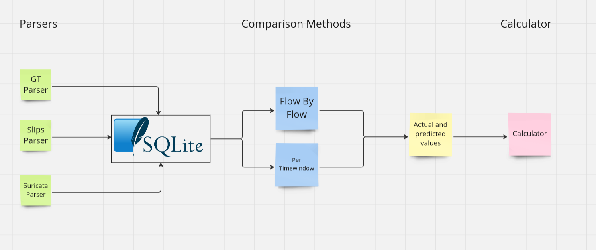

# Installation

pip3 install -r requirements.txt

---

# Usage 

python3 main.py -s <slips_db_abs_path> -e <eve.json_abs_path> -g <ground_truth_labeled_zeek_dir_abs_path>

for testing, use this command:

***Example of using labeled ground truth dir***

python3 main.py -gtd $(pwd)/dataset/CTU-Malware-Capture-Botnet-4/ground_truth/ -s $(pwd)/dataset/CTU-Malware-Capture-Botnet-4/slips/flows.sqlite -e $(pwd)/dataset/CTU-Malware-Capture-Botnet-4/suricata/eve.json  

***Example of using ground truth file***

python3 main.py -gtf $(pwd)/dataset/CTU-Malware-Capture-Botnet-4/ground_truth/conn.log.labeled -s $(pwd)/dataset/CTU-Malware-Capture-Botnet-4/slips/flows.sqlite -e $(pwd)/dataset/CTU-Malware-Capture-Botnet-4/suricata/eve.json  

python3 main.py -s $(pwd)/dataset/2023-02-20/2023-02-20/slips/flows.sqlite -e $(pwd)/dataset/2023-02-20/2023-02-20/suricata/eve.json -gtf $(pwd)/dataset/2023-02-20/2023-02-20/zeek_labeled/conn.log.labeled 

python3 main.py -s $(pwd)/dataset/Experiment-VM-Linux-Ubuntu2204-1-2023-02-25/slips/flows.sqlite -e $(pwd)/dataset/Experiment-VM-Linux-Ubuntu2204-1-2023-02-25/suricata/eve.json -gtf $(pwd)/dataset/Experiment-VM-Linux-Ubuntu2204-1-2023-02-25/ground_truth/conn.log.labeled 

python3 main.py -e $(pwd)/dataset/Experiment-VM-Microsoft-Windows7AD-1-2023-02-26/suricata/eve.json -s $(pwd)/dataset/Experiment-VM-Microsoft-Windows7AD-1-2023-02-26/slips/flows.sqlite -gtf $(pwd)/dataset/Experiment-VM-Microsoft-Windows7AD-1-2023-02-26/zeek_labeled/conn.log.labeled


# Comparison Tool Input

The tool needs the following 3 to run:
1. Slips db
2. suricata eve.json
3. a labeled conn.log file


#### Slips DB 

Slips stores the AID hash for each conn.log flow in the sqlite db

The SQL table with the AID and label in Slips is called 'flows' inside the ```flows.sqlite``` db

This tool reads the ```flows.sqlite``` db, extracts the labels and AIDs,
and stores them in its' own db stored in ```output/<date-time>/db.sqlite```

it calculates the aid of each read flow on the fly using the (zeek's community_id + ts) combination by using the aid_hash 
lib from pypi
https://pypi.org/project/aid-hash


#### suricata eve.json

This tool reads Suricata's eve.json file 

if the field event_type is set to 'alert', this tool marks this flow as malicious by suricata.

it calculates the aid of each read flow on the fly using the (community_id + ts) combination by using the aid_hash 
lib from pypi
https://pypi.org/project/aid-hash


---

# Comparison tool output

The output directory of this tool can be specified using -o, for example:

```
python3 main.py -e suricata/eve.json -s slips/flows.sqlite -gtf zeek/conn.log.labeled -o some_dir
```

if -o is not given, it creates a new dir inside ```output/``` with the date and time of the run.

The output of this tool consists of:

1. a sqlite db with labels per flow, and labels per time window, it also has the performance errors and, total flows count and the files read of each tool. 

The sqlite db created by this tool is stored in a subdir in the output/ dir
for example
```output/2023-07-10-14:04:16```

2. the metrics printed in the CLI and to the output directory in results.txt at the end of the analysis

3. a metadata file with the versions and files used


---

# How it works



1. This tool consists of 3 parsers, the ground truth parser runs first, once it's done the slips and suricata parsers start in parallel
2. The 3 parsers job is to store the label for each tool in the sqlite database
3. labels are stored per flow and per timewindow
4. the tool then retrieves the actual and predicted value of each of the given tools and passes them to the calculator for calculating the metrics

## Comparison Method 1: How labels per timewindow are calculated
Timewindow labels are detected in the following way:

A timewindow is 1h interval, the given pcap is split into as many 1h intervals as needed and each interval (timewindow) has 1 label, either malicious or benign

#### for slips
the slips database given to this tool using -s contains a table called alerts where slips stores the malcious timewindows with their label, start and end date.


#### Applying the timewindow concept for the ground truth
we read 1h worth of 
flows, once we find one 'malicious' label, we consider their entire timewindow as malicious, if there is no malicious flows in there, we mark that timewindow as benign


#### Applying the timewindow concept for suricata

Same as the ground truth. we read 1h worth of flows, once we find one 'malicious' label, we consider their entire timewindow as malicious, if there is no malicious flows in there, we mark that timewindow as benign

If a timewindow was detected by one of the tools, and not detected by the ground truth, for example negative timewindows in slips, 
we consider the gt label of it as "benign"


## Comparison Method2: labels flow by flow

#### for slips

The slips database given to this tool using -s contains a table called flows where each flow is stored with its label. 
The flow is considered malicious by slips if it was part of an alert.
Slips detects alerts based on a complex ensembling algorithm, check it Slips documentation for more about this.

#### for suricata
The eve.json given to this tool using -e contains flows and event_type = 'alert'.
Each alerts is marked as malicious and each flow is marked as benign

#### for the ground truth
Ground truth flows are labeled using the netflow labeler. so each flow has a label either benign or malicious

---

# Limitations

* the labels in ground truth zeek dir have to be 'Malicious' or 'Benign' only. if any other label is present this tool will consider it "benign"
* ground truth dirs can either be json or tab separated zeek dir or conn.log file

* all paths given as parameters to this tool must be absolute paths.
* if any flow doesn't have a label by suricata or slips, this tool considers the flow as benign 

* slips now labels conn.log flows only, just like zeek does when zeel's community_id is enabled as a plugin

* all flows read by a tool, that don't have a matching flow in the ground truth file, are discarded. the number if discarded flows is written in the cli

* we only read even_type= "flow" or "alert" in suricata eve.json files

* the flows read by suricata, slips and the gt don't have to be the same, aka the final flows count don't have to match because each tool reads the pcap differently

* timewindow number may be negative if a flow is found with a flow_ts < ts of the first flow seen

---


# Used cmds

* command for generating all zeek files in the dataset/

``` zeek -C -r <pcap>  tcp_inactivity_timeout=60mins tcp_attempt_delay=1min```


* command for labeling conn.log files

``` python3 netflowlabeler.py -c labels.config -f /path/to/generated/conn.log ```

* (optional) To label the rest of the Zeek files using an already labeled conn.log file (conn.log.labeled)

```zeek-files-labeler.py -l conn.log.labeled -f folder-with-zeek-log-files```

* command for extracting mac accumulated threat level for all timewindows from an alert.json 

```python3 scripts/max_accumulated_score_extractor_for_slips.py alerts.json <host_ip>```


* command for getting the bet slips threshold given the extracted ground truth labels and max accumulated scores

note: this script assumes the correct ground truth labels are in scripts/extracted_gt_tw_labels.py
and the correct max accumulated scores of slips are in scripts/extracted_levels.py 

```
python3 scripts/slips_threshold_getter.py
```


* command for extracting ground truth labels from a conn.log.labeled file
note: we only extract the labels per timewindow per ip

```
git checkout origin/ground_truth_timewindow_label_extractor
python3 main.py -gtf conn.log.labeled -i <host_ip>
```


